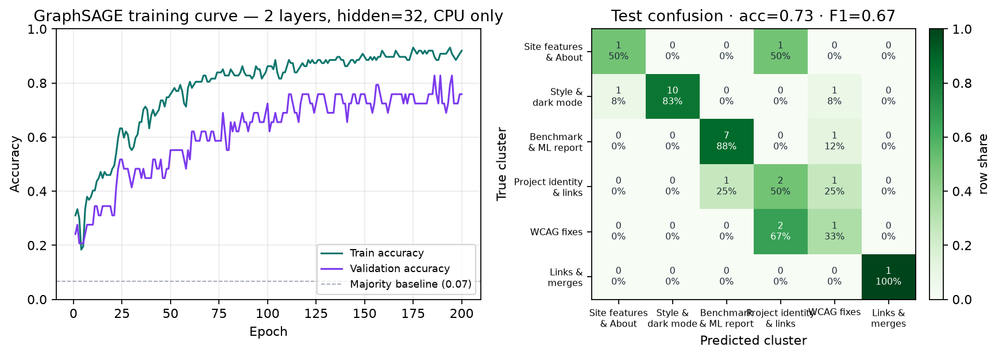
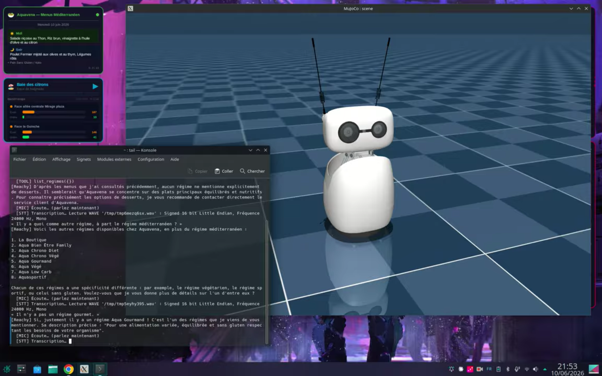
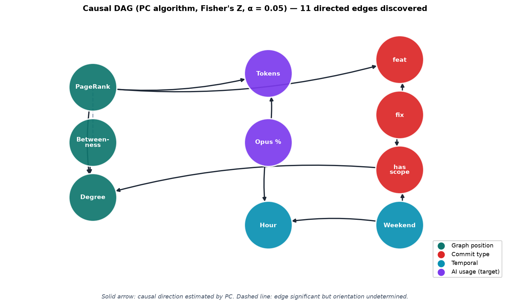
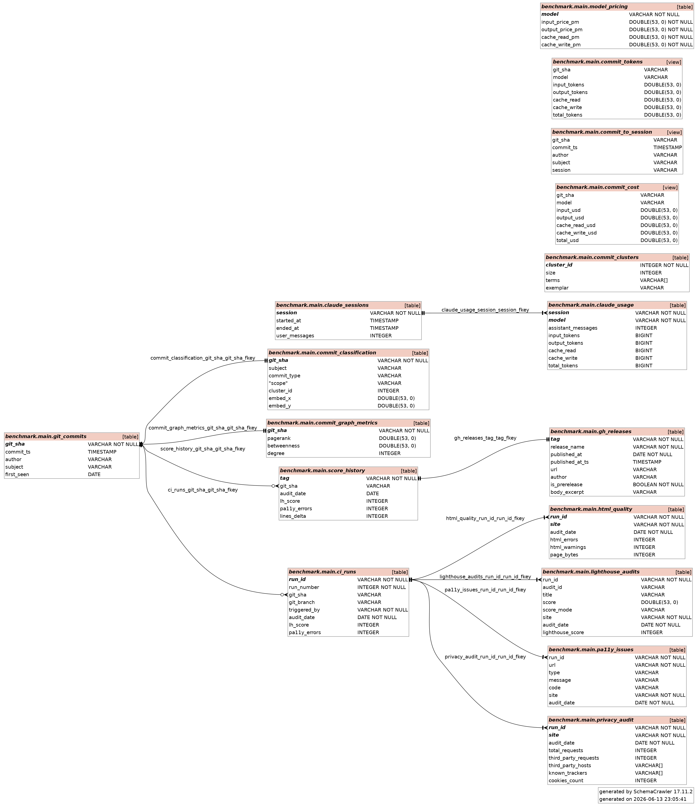

# 1. The problem · *one user, one menu, one barrier* {background-color="#0f172a"}

**Ma mère.** Cliente Aquavena depuis des années.

**Elle est malvoyante.** Le site officiel est inaccessible.

> Chaque semaine, elle doit attendre qu'on lui lise les menus à voix haute pour pouvoir commander.

::: {.fragment}
Ce petit manque d'autonomie, **répété toutes les semaines**, est devenu un point de bascule.
:::

::: {.fragment}
**La question :** est-ce que quelques heures de code peuvent lui rendre cette autonomie ?
:::

---

# 2. The bet · *un site accessible en un week-end*

::: {.columns}
::: {.column width="55%"}
- **Astro v6**, statique, hébergé GitHub Pages
- **Lecture vocale** (Web Speech API)
- **Mode nuit**, **A+/A−** taille de texte
- **Police Atkinson Hyperlegible**
- **PWA** installable hors ligne
- **RSS et iCal** par régime
:::

::: {.column width="45%"}
**[adriens.github.io/aquavena](https://adriens.github.io/aquavena/)**

*(démo cliquable)*
:::
:::

::: {.notes}
Montrer le site live. Lecture vocale. Mode nuit. Démontrer A+/A−.
:::

---

# 3. The proof · *les chiffres parlent*

| Métrique | aquavena.nc | adriens.github.io/aquavena |
|---|---|---|
| **Lighthouse Accessibility** | 91 / 100 | **100 / 100** |
| **WCAG 2.1 AA errors (pa11y)** | 67 | **0** |
| **Trackers third-party** | 12 | **0** |
| **Score AIM** | — | **10 / 10** |

::: {.fragment}
**Pas un effet d'annonce :** 26 releases consécutives ont maintenu le score 100/100.
:::

---

# 4. From personal to systemic · *le pivot*

::: {.columns}
::: {.column width="50%"}
**Le problème :** comment savoir *objectivement* qu'un site est accessible ?

**La réponse classique :** audit manuel, subjectif, non reproductible.

**Notre réponse :** **une pipeline complète** qui mesure, persiste et publie.
:::

::: {.column width="50%"}
**4 étapes**

1. \faSearchPlus\ `pa11y-ci` + Lighthouse + W3C
2. \faFileCode\ JSON structuré
3. \faDatabase\ DuckDB (FK schema)
4. \faFilePdf\ Rapport Quarto + XeLaTeX
:::
:::

::: {.fragment}
**Le rapport benchmark s'auto-publie à chaque commit.**
:::

---

# 5. DORA Elite · *la cadence de livraison*

::: {.columns}
::: {.column width="33%"}
**\faRocket\ Deployment Frequency**

**19.9 / day**

*Elite*
:::

::: {.column width="33%"}
**\faClock\ Lead Time**

**4.6 min**

*Elite*
:::

::: {.column width="33%"}
**\faWrench\ MTTR**

**26 min**

*Elite*
:::
:::

::: {.fragment}
**Référence officielle :** Forsgren et al., *Accelerate State of DevOps 2023*
([dora.dev/research/2023](https://dora.dev/research/2023/dora-report/))
:::

::: {.notes}
DORA = DevOps Research and Assessment (Google), à ne pas confondre avec DORA UE (Digital Operational Resilience Act).
:::

---

# 6. EVM / SPI · *PMI vocabulary, real data*

::: {.columns}
::: {.column width="50%"}
**Planned Value vs Earned Value**

Le projet a délivré **Earned Value ≥ Planned Value** sur **100 % des releases**.

**SPI = EV / PV > 1.0** sur toutes les `v*.*.*`.

→ **Jamais en retard sur le plan, depuis le jour 1.**
:::

::: {.column width="50%"}
**Sources de vérité (zéro saisie manuelle)**

- `score_history.duckdb` — Lighthouse par tag
- `gh_releases.published_at_ts` — timestamps officiels
- `ci_runs` — Lead Time, MTTR
- `commit_classification` — BUILD vs RUN

\faChartLine\ *Tout est dans le rapport benchmark, chart 2.1.*
:::
:::

---

# 7. Causal Impact · *prouver l'effet d'une décision*

::: {.columns}
::: {.column width="50%"}
**La méthode :** Bayesian Structural Time Series (BSTS) via le package **CausalImpact** de Google.

**3 interventions analysées :**

- Tailwind v3 → v4 → non concluant
- WebMCP → trop récent
- **ML pivot (v1.8.0) : +378 M tokens, p = 0.003**
:::

::: {.column width="50%"}
**Verdict ML pivot (v1.8.0)**

| Métrique | Valeur |
|---|---|
| Effet cumulé | **+378 M tokens** |
| CI 95% | [+122 ; +637] |
| p-value | **0.003** |
| Verdict | **significatif** |

\faLink\ [CausalImpact CRAN](https://cran.r-project.org/web/packages/CausalImpact/vignettes/CausalImpact.html)
:::
:::

::: {.fragment}
**On passe de "j'ai mesuré X" à "X a causé Y avec un intervalle de crédibilité".**
:::

---

# 8. GraphSAGE GNN · *la structure code le sens*

::: {.columns}
::: {.column width="50%"}
**La question :** peut-on classer un commit **sans lire son texte**, juste à partir de sa position dans le graphe ?

**Le résultat :** **73 % d'accuracy** (vs **6.7 %** baseline).

**Lift de +66 points.**

**Implication :** la structure du graphe **encode la sémantique**.
:::

::: {.column width="50%"}
{width="100%"}
:::
:::

---

# 9. WebMCP · *le site devient agentique* {background-color="#0f172a"}

**Le site expose désormais 5 outils standardisés au navigateur :**

```
list_regimes()        get_week_menu(slug)
search_dish(query)    get_today_menus()
get_contact()
```

::: {.fragment}
**Conséquence :** un agent IA peut **lire les menus directement**, sans lire le HTML, **avant même qu'un humain n'ouvre la page**.
:::

::: {.fragment}
**Token Origin Trial Chrome 149+ déjà intégré.**
:::

---

# 10. Reachy Mini · *preuve par le robot*

::: {.columns}
::: {.column width="55%"}
**Reachy Mini** (HuggingFace / Pollen Robotics) appelle l'API MCP d'Aquavena **en live** et lit les menus à voix haute.

**Démo vidéo :** [👉 YouTube](https://www.youtube.com/watch?v=c_sMVO94ssY)
:::

::: {.column width="45%"}
{width="100%"}
:::
:::

::: {.fragment}
**Un robot, un site, les mêmes 5 outils.**
:::

---

# 11. Universal accessibility pipeline · *le diagramme*

{width="65%"}

::: {.fragment}
**Aveugle · dyslexique · malvoyant · daltonien · custom** — chaque agent simule un profil WCAG.

**CI continu (~secondes)** vs **Release candidate humain (~semaines).**
:::

---

# 12. Methodology dashboard · *la BI side*

::: {.columns}
::: {.column width="50%"}
**Pour les BI specialists :**

- **DuckDB** = data warehouse portable
- **12 tables** avec **schema FK strict**
- **R / `ggplot2`** pour les charts
- **Embeddings BAAI/bge-m3** pour le NLP
- **PyTorch Geometric** pour les GNN
- **CausalImpact** pour la causalité
- **PC algorithm** pour les DAGs
:::

::: {.column width="50%"}
{width="100%"}
:::
:::

::: {.fragment}
**Toute la chaîne est open-source, reproductible, transferable.**
:::

---

# 13. Transferability · *pas qu'une histoire perso*

**Tout ce que vous avez vu marche pour :**

::: {.columns}
::: {.column width="50%"}
- **Sites publics NC** (mairies, OPT, etc.)
- **Services hospitaliers**
- **Plateformes éducatives**
- **Sites associatifs** *(ex: Valentin Haüy)*
:::

::: {.column width="50%"}
- **Banques** (DORA UE en plus du DORA Google)
- **E-commerce**
- **Services civiques digitaux**
- **Tout site avec ≥1 utilisateur empêché**
:::
:::

::: {.fragment}
**Le template `benchmark/` est ouvert. Forkez-le, branchez votre site, vos données.**
:::

---

# 14. Lessons learned · *5 takeaways pour PMI*

::: {.incremental}
1. **Les conventional commits sont une source de vérité.** Pas besoin de tracker, l'historique git suffit.
2. **Mesurer l'accessibilité, c'est en faire un objectif de sprint.** Le score est une Business Value Scrum (BV = $s_{after} - s_{before}$).
3. **Une vraie causalité, pas juste des corrélations.** BSTS + PC algorithm font la différence.
4. **Le AI-leverage ratio est mesurable.** *On sait quel type de travail coûte le plus en tokens IA.*
5. **L'accessibilité n'est pas un coût, c'est un investissement.** 5.5× plus de tokens IA pour les fixes WCAG → c'est du travail cognitivement profond.
:::

---

# 15. Conclusion · *« start with why »* {background-color="#0f172a"}

> *Si quelques heures de code peuvent rendre un peu d'autonomie à une personne, ça vaut le coup.*

::: {.columns}
::: {.column width="50%"}
**Une mère.**

**Un site accessible.**

**Une méthodologie ouverte.**

**Un robot qui lit les menus.**
:::

::: {.column width="50%"}
\faGithub\ [github.com/adriens/aquavena](https://github.com/adriens/aquavena)

\faFilePdf\ [Rapport complet](https://github.com/adriens/aquavena/releases/latest)

\faLinkedin\ [linkedin.com/in/adrien-sales](https://linkedin.com/in/adrien-sales)

\faTwitter\ [x.com/rastadidi](https://x.com/rastadidi)
:::
:::

::: {.fragment}
**Merci. Questions ?**
:::
